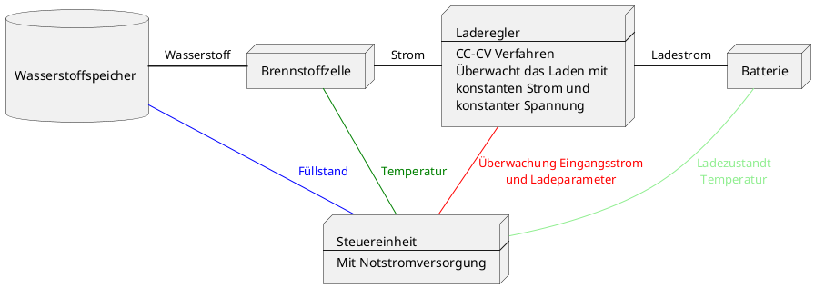
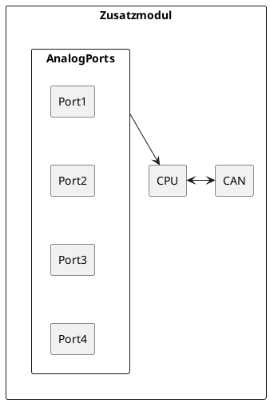
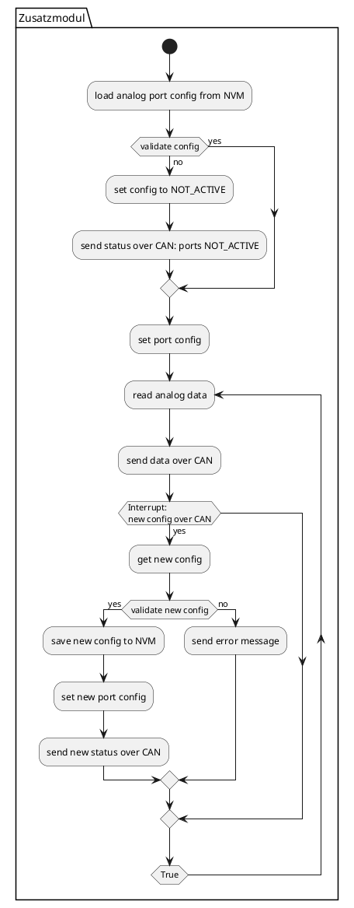
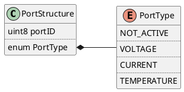

# Embedded Software Enginieer Aufgaben zur Vorstellung

## Aufgabe 1

Das System sollte mindestens aus einem Wasserstoffspeicher, einer Brennstoffzelle, einem Laderegler, einer Steuereinheit und einer Batterieanlage in geeigneter größe bestehen.

Um die Sicherheit im System zu gewährleisten überwacht die Steuereinheit, parameter wie den Füllstand des Wasserstoffspeichers, die Temperatur der Brennstoffzelle, Ladeparameter und Batterietemperatur und Ladestand.
Zudem ist die Steuereinheit mit ihrem eigenem Notstromspeicher ausgestattet um bei Fehlersituationen das System Abschalten zu können.

## Aufgabe 2

Dieser Vorschlag gilt für eine baremetal singlecore implementierung. Hierbei ist zu beachten das während der neu Konfiguration keine Daten über den CAN-bus verschickt werden können. Dieser Usecase ist aber sehr unwarscheinlich da die neu Konfiguration eine Hardwareänderung zur Grundlage hat.
